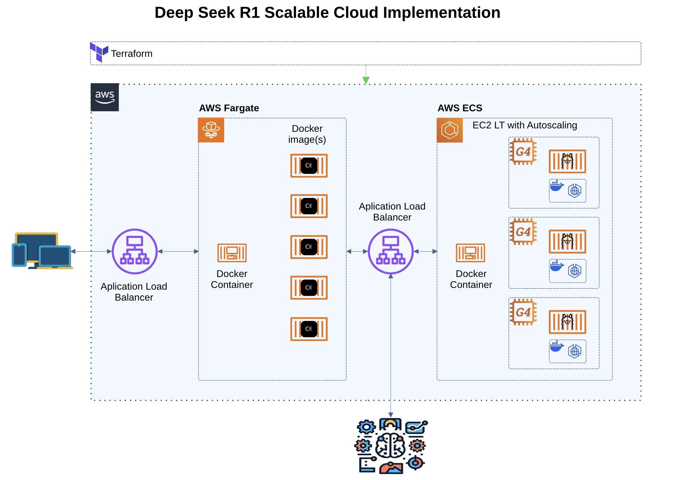

# 🚀 DeepSeek-R1 Deployment on AWS (ECS + Fargate)

## 📌 Overview
This repository contains the necessary Terraform configuration and Docker setup to deploy **DeepSeek-R1-Distill-Qwen-7B-GGUF** using **Ollama** on **AWS ECS (Fargate & EC2)** with **Application Load Balancer (ALB)**.

The infrastructure includes:
- **Amazon ECS (Elastic Container Service)**: Runs DeepSeek-R1 as a containerized application.
- **AWS Fargate**: Serverless execution for Open WebUI.
- **EC2 Instances (G4dn.xlarge)**: Optimized for GPU-based inference.
- **Amazon ECR (Elastic Container Registry)**: Stores Docker images.
- **Application Load Balancer (ALB)**: Routes traffic to DeepSeek.
- **AWS VPC (Virtual Private Cloud)**: Secure network setup.
- **IAM Roles & Security Groups**: Permissions & security settings.

### **Infrastructure Diagram**


---

## 🏗️ Infrastructure Setup

### **1️⃣ Prerequisites**
Before running Terraform, make sure you have:
- **AWS CLI** installed & configured (`aws configure`).
- **Terraform** installed (`terraform -v`).
- **Docker** installed (`docker -v`).

### **2️⃣ Infrastructure Deployment**
Run the following commands to provision AWS resources:
```sh
terraform init  # Initialize Terraform
terraform apply -auto-approve  # Deploy Infrastructure
```
Terraform will:
✅ Create **ECS Cluster**
✅ Deploy **Fargate for Open WebUI**
✅ Setup **ALB & Networking**
✅ Launch **DeepSeek-R1 on EC2 with GPU**

After deployment, Terraform will output the **Load Balancer URL**, which you can use to access the service.

---

## 🐳 Docker Setup

### **1️⃣ Build & Push DeepSeek Image**
```sh
aws ecr get-login-password --region us-east-1 | docker login --username AWS --password-stdin <ECR_URL>
docker build -t deepseek-image .
docker tag deepseek-image <ECR_URL>:latest
docker push <ECR_URL>:latest
```

### **2️⃣ Run DeepSeek Locally**
```sh
docker run --gpus all -p 11434:11434 deepseek-image
```

---

## 📄 install.sh Script (GPU + Docker Setup)
The `install.sh` script automates the installation of:
✅ **NVIDIA Drivers & Container Toolkit**
✅ **Docker**
✅ **DeepSeek Model in Ollama**

### **Run it on EC2:**
```sh
chmod +x install.sh
./install.sh
```

---

## 🌎 Accessing the Deployment
Once Terraform is applied, you can access DeepSeek-R1 via:
```
http://<load-balancer-url>
```
To interact with the API, use:
```sh
curl http://<load-balancer-url>/api/generate -d '{"model": "deepseek-r1-distill-qwen", "prompt": "Hello!"}'
```

---

## 🔥 Future Improvements
- ✅ **Auto Scaling for EC2 Instances**
- ✅ **CloudWatch Monitoring & Logs**
- ✅ **Additional Security Best Practices**

🚀 **Contributions are welcome!** Feel free to open issues or submit PRs.

